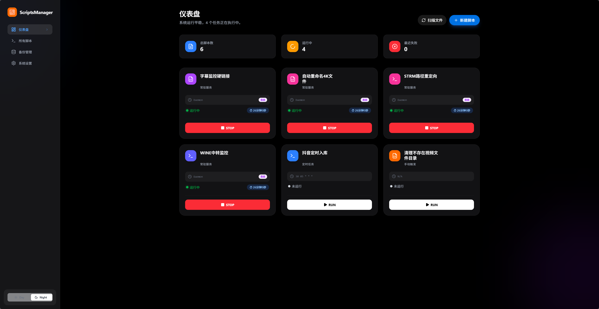
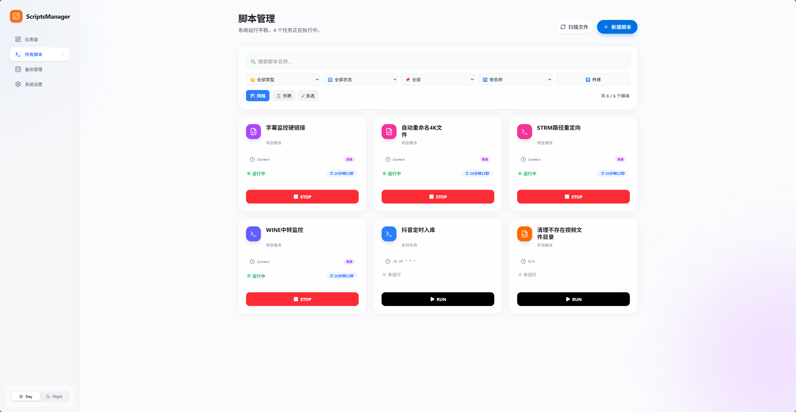
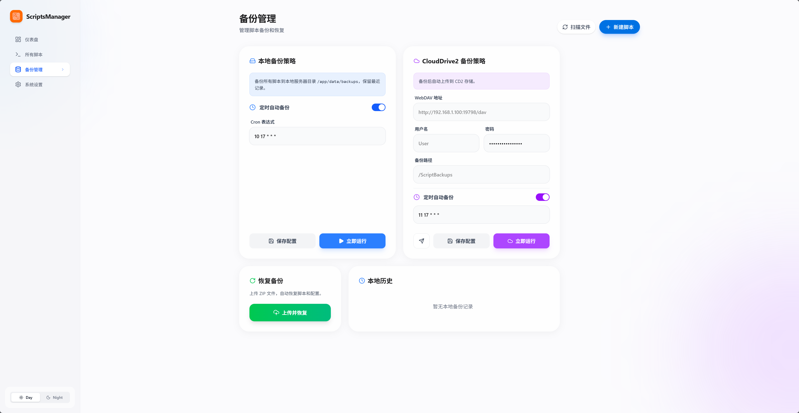
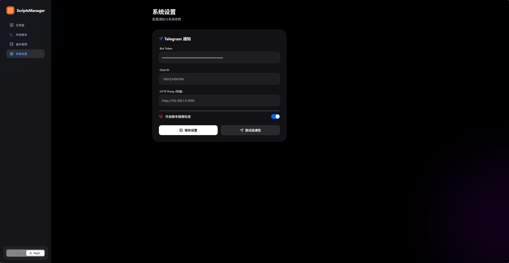

# 🚀 ScriptsManager

<p align="center">
  
  
  
  
  
</p>

<p align="center">
  <b>🎯 一个现代化的 Web 脚本管理和调度系统</b>
</p>

<p align="center">
  轻松管理你的自动化脚本 | 强大的定时调度 | Telegram 机器人集成 | 完美 Docker 部署
</p>

---

## 📸 界面预览

| 脚本列表 | 脚本编辑器 |
|:---:|:---:|
|  |  |

| 实时日志 | 系统设置 |
|:---:|:---:|
|  |  |

---

## ✨ 功能特性

### 📝 脚本管理
- **多语言支持** - 支持 Python (.py) 和 Shell (.sh) 脚本
- **在线编辑器** - 内置 Monaco Editor 代码编辑器，支持语法高亮、自动补全
- **脚本参数** - 支持为脚本配置运行参数，灵活应对不同场景
- **一键操作** - 快速运行、停止、删除脚本

### ⏰ 定时调度
- **Cron 表达式** - 完整支持标准 Cron 表达式，精确到分钟级调度
- **开机自启** - 支持设置脚本在系统启动时自动运行
- **常驻进程** - 使用 `@daemon` 标记常驻后台运行的脚本
- **调度开关** - 随时启用/禁用脚本的定时调度

### 📊 实时日志
- **WebSocket 推送** - 实时查看脚本运行输出，无需刷新页面
- **日志历史** - 保留每个脚本的完整运行日志
- **状态追踪** - 实时显示脚本运行状态：运行中 🟢 / 成功 ✅ / 失败 ❌ / 已停止 ⏹️

### 🤖 Telegram 集成
- **执行通知** - 脚本执行完成后自动推送结果到 Telegram
- **远程控制** - 通过 Telegram 机器人远程运行脚本
- **代理支持** - 支持配置 HTTP 代理访问 Telegram API

### 💾 备份与恢复
- **本地备份** - 一键导出所有脚本和配置
- **WebDAV 备份** - 支持 CloudDrive2 等 WebDAV 服务远程备份
- **快速恢复** - 从备份文件一键恢复所有数据

### 🎨 其他特性
- **深色模式** - 支持浅色/深色主题切换，保护你的眼睛 👀
- **健康检查** - 自动监控常驻脚本的运行状态
- **响应式设计** - 完美适配桌面和移动设备

---

## 🐳 快速开始

### 使用 Docker Compose (推荐)

**1️⃣ 克隆仓库**
```bash
git clone https://github.com/Ch1swill/ScriptsManager.git
cd ScriptsManager
```

**2️⃣ 准备目录**
```bash
mkdir -p scripts data
```

**3️⃣ 创建配置文件**

复制示例配置：
```bash
cp docker-compose.example.yml docker-compose.yml
```

或直接创建 `docker-compose.yml`：
```yaml
services:
  scripts-manager:
    image: ch1swill/scripts-manager:latest
    container_name: scripts-manager
    restart: unless-stopped
    ports:
      - "4396:4396"
    volumes:
      # 脚本目录
      - ./scripts:/scripts
      # 持久化数据 (数据库和日志)
      - ./data:/data
      # 可选: 挂载外部存储 (如 NAS)
      # - /mnt/nas:/mnt/nas
    environment:
      - TZ=Asia/Shanghai
```

**4️⃣ 启动服务**
```bash
docker-compose up -d
```

**5️⃣ 访问界面**

打开浏览器访问: **http://localhost:4396** 🎉

---

## ⚙️ 配置详解

### 🌍 环境变量

| 变量 | 默认值 | 说明 |
|:---|:---|:---|
| `TZ` | `UTC` | 🕐 **时区设置** - 影响定时任务的执行时间和日志时间戳。推荐设置为 `Asia/Shanghai` (北京时间) 或你所在的时区 |
| `SCRIPT_ROOT` | `/scripts` | 📁 **脚本根目录** - 容器内存储脚本的路径，一般无需修改 |
| `DATABASE_URL` | `sqlite:///data/manager.db` | 🗄️ **数据库路径** - SQLite 数据库文件位置，一般无需修改 |

### 📂 卷挂载说明

| 主机路径 | 容器路径 | 必需 | 说明 |
|:---|:---|:---:|:---|
| `./scripts` | `/scripts` | ✅ | 📜 **脚本文件目录**<br>存放所有 Python 和 Shell 脚本。你可以在 Web 界面创建脚本，也可以直接将脚本文件放入此目录 |
| `./data` | `/data` | ✅ | 💾 **持久化数据目录**<br>包含：<br>• `manager.db` - SQLite 数据库，存储脚本配置、调度设置等<br>• `logs/` - 脚本运行日志文件 |
| `/mnt/nas` | `/mnt/nas` | ❌ | 🗃️ **外部存储挂载** (可选)<br>如果你的脚本需要访问 NAS、移动硬盘或其他外部存储，可以挂载到容器中 |

### 💡 挂载示例

**基础配置** - 仅必需目录：
```yaml
volumes:
  - ./scripts:/scripts
  - ./data:/data
```

**进阶配置** - 挂载多个外部存储：
```yaml
volumes:
  - ./scripts:/scripts
  - ./data:/data
  # 挂载 NAS 共享目录
  - /mnt/nas:/mnt/nas
  # 挂载下载目录
  - /home/user/downloads:/downloads
  # 挂载媒体库
  - /srv/media:/media:ro  # ro = 只读
```

> 💡 **提示**: 挂载外部存储时，确保 Docker 有权限访问这些路径。如果脚本只需要读取数据，建议使用 `:ro` 只读挂载。

---

## 🔧 常见用例

### 📌 监控脚本 (常驻进程)
```
名称: 端口监控
路径: /scripts/monitor.sh
Cron: @daemon
开机自启: ✅
```
> 使用 `@daemon` 标记的脚本会被系统自动监控，异常退出时会发送告警

### 📌 定时任务
```
名称: 每日备份
路径: /scripts/backup.py
Cron: 0 3 * * *  (每天凌晨3点)
开机自启: ❌
```

### 📌 手动执行脚本
```
名称: 数据清理
路径: /scripts/cleanup.sh
Cron: (留空)
开机自启: ❌
```
> 不设置 Cron 表达式的脚本只能通过 Web 界面手动触发

---

## 🤖 Telegram 机器人配置

1. 在 Telegram 中找到 [@BotFather](https://t.me/BotFather)，创建新机器人获取 Token
2. 获取你的 Chat ID (可以使用 [@userinfobot](https://t.me/userinfobot))
3. 在 ScriptsManager 设置页面填入 Token 和 Chat ID
4. 点击「测试连接」确认配置正确

**机器人命令:**
- `/list` - 查看所有脚本
- `/run <脚本名>` - 运行指定脚本
- `/status` - 查看运行中的脚本

---

## 📋 常见问题

<details>
<summary><b>❓ 脚本执行报错 "Permission denied"</b></summary>

确保脚本文件有执行权限：
```bash
chmod +x scripts/your_script.sh
```
</details>

<details>
<summary><b>❓ 定时任务没有按时执行</b></summary>

1. 检查 `TZ` 环境变量是否正确设置
2. 确认脚本的「启用调度」开关已打开
3. 检查 Cron 表达式是否正确
</details>

<details>
<summary><b>❓ Telegram 通知发送失败</b></summary>

1. 检查 Token 和 Chat ID 是否正确
2. 如果在中国大陆使用，需要配置代理
3. 点击「测试连接」查看具体错误信息
</details>

<details>
<summary><b>❓ 如何查看历史日志</b></summary>

日志文件保存在 `./data/logs/` 目录下，每个脚本一个日志文件。也可以在 Web 界面点击「日志」标签页查看。
</details>

---

## 📜 许可证

本项目基于 [MIT License](LICENSE) 开源。

---

## 🙏 贡献

欢迎提交 Issue 和 Pull Request！

如果觉得这个项目有用，请给一个 ⭐ Star 支持一下！

---

<p align="center">
  Made with ❤️ by <a href="https://github.com/Ch1swill">Ch1swill</a>
</p>
